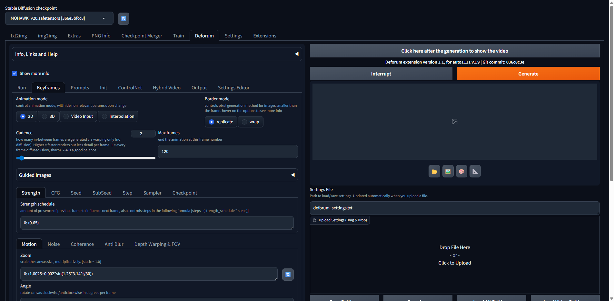
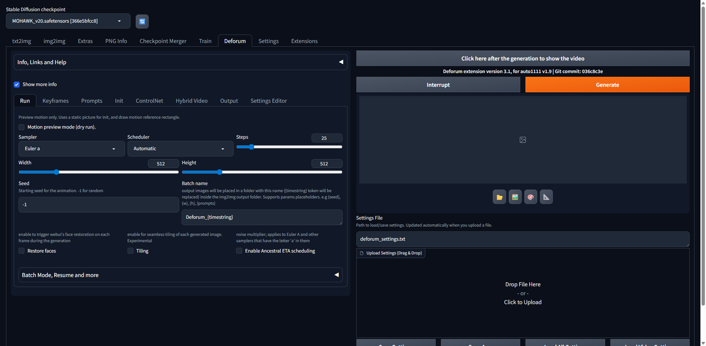
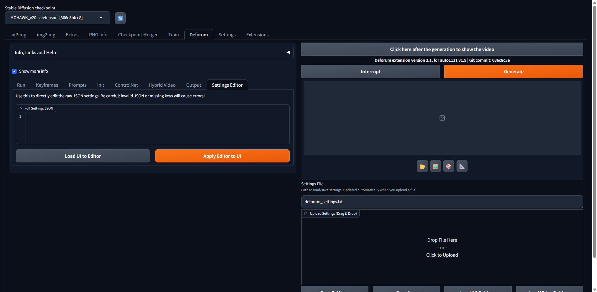
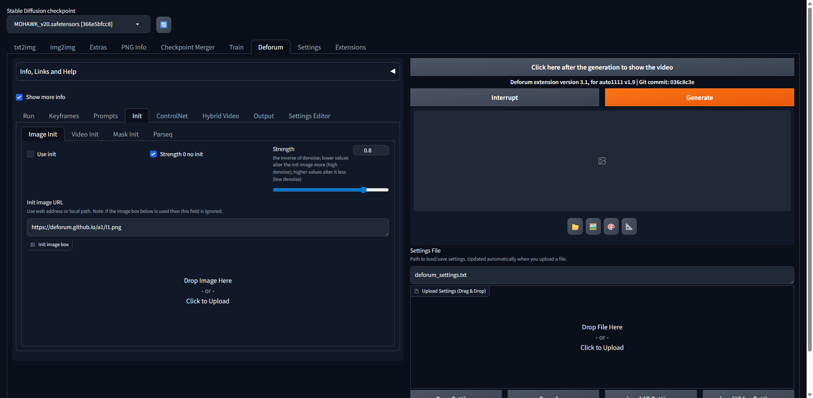
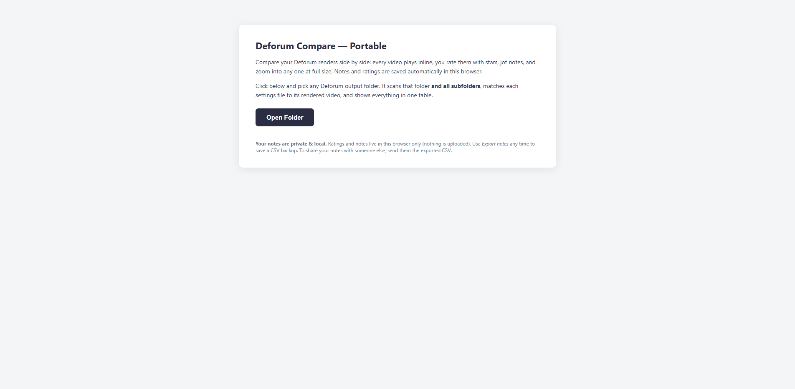

# Deforum Stable Diffusion -- m1llipede fork

> **Fork of [deforum-art/sd-webui-deforum](https://github.com/deforum-art/sd-webui-deforum)** with UI improvements, workflow tools, and practical documentation focused on usability during long render sessions.

This fork doesn't change the render engine. It only changes the UI and adds tools around it. Everything renders the same as upstream -- you just spend less time fighting the interface and more time iterating.

---

## 🎬 Start here — Microcosm ([`microcosm/`](microcosm/))

**The render viewer, my best settings, and the notes behind them.** The viewer needs nothing installed — download one HTML file, double-click it, drag a render in, and watch the prompt / LoRAs / FOV / camera update **at the frame you're looking at**. Tick two renders to compare every parameter side by side with the differences highlighted.

- **[`microcosm/Microcosm.html`](microcosm/Microcosm.html)** — the viewer (no install, works offline)
- **[`microcosm/BEST_DEFAULT_settings.txt`](microcosm/BEST_DEFAULT_settings.txt)** — the real Microcosm recipe: prompts, full LoRA stack, init image
- **[`microcosm/BEST_PRACTICES.txt`](microcosm/BEST_PRACTICES.txt)** — what causes streaking, the smoothness recipes, camera rules
- **[`microcosm/gallery-tab/`](microcosm/gallery-tab/)** — optional: the same gallery live inside A1111

**[→ Full guide in `microcosm/README.md`](microcosm/README.md)**

---

## Panel additions in this fork

- **Preset dropdown** — pick a saved recipe, it loads into every field. Presets are ordinary complete settings `.txt` files in a `presets/` folder next to the WebUI.
- **Drag-and-drop preset import** — drop any number of settings files to add them as presets. Each is validated, has its `init_image` repaired if the file moved (or `use_init` turned off if it's genuinely gone — this silently breaks loads otherwise), and stale resume-timestrings cleared.
- **Folders accordion** — init-images and video/ControlNet input folders with a native folder picker. Models folder shown read-only, with a note that it's fixed at launch via `--ckpt-dir`.
- **SUGGESTED values and info text** on parameters and ControlNet toggles that shipped with none.

---

## 🏆 Best settings ever — Spore Mandala

The single best result to date. A 15,000-frame, 1024x1024, 30fps two-cycle journey:
geometric node-mandalas → a fractalized biological universe (mushroom caves, hidden
faces, eyes, owls and wolves, fractal butterflies and caterpillars) → vast empty space
→ wormhole → biological singularity, then repeats. Hidden faces and creatures emerge
"out of nowhere" throughout. Negatives live in the negative-prompt field, not inline.

**[`examples/Spore_Mandala_BEST_EVER_settings.txt`](examples/Spore_Mandala_BEST_EVER_settings.txt)**

The numbers that matter for this one:

| Setting | Value | Why |
|---|---|---|
| Sampler / scheduler | DPM++ 2M SDE / Karras | smooth, detail-preserving |
| Steps | 35 | clean frames, fast enough for 15k |
| `strength_schedule` | `0:(0.7)` | strong scene persistence with init |
| `cfg_scale_schedule` | `0: (8)` | punchy guidance for dense psychedelia |
| `noise_schedule` | `0: (0.01)` | low per-frame noise, stable scene |
| `diffusion_cadence` | `8` | high consistency over thousands of frames |
| `color_coherence` | LAB | locks the palette across the journey |
| `midas_weight` | `-0.3` | inverted depth = the signature inside-out psychedelic warp |
| `translation_z` | `0: (2.25)` | steady forward travel through the worlds |
| Keyframes | 43 @ 350-frame spacing | dense schedule, two full cycles |
| `add-detail-xl` LoRA | `0.8` | maximum fine detail without crunch |

---

## ⭐ Recommended starting settings

The single best long-form recipe to date is included as a ready-to-load preset:

**[`examples/Microcosm_Best_settings.txt`](examples/Microcosm_Best_settings.txt)**

Load it via the Deforum tab's "Load all settings" button, then swap in your own
prompts. It is a 15,000-frame, 1024x1024, 30fps organic micro-world walk-through
tuned for long-run coherence. The numbers that matter:

| Setting | Value | Why |
|---|---|---|
| Sampler / scheduler | DPM++ 2M SDE / Karras | smooth, detail-preserving |
| Steps | 40 | enough for clean frames without crawl |
| `strength_schedule` | `0: (0.6)` | frame-to-frame persistence without smearing |
| `cfg_scale_schedule` | `0: (6)` | guidance without over-baking |
| `noise_schedule` | `0: (0.01)` | low per-frame noise = stable scene |
| `noise_multiplier_schedule` | `0: (1.0)`, scheduling **off** | avoids the compounding-noise blowup that destroys coherence over thousands of frames |
| `diffusion_cadence` | `5` | strong consistency; in-between frames are warped, not re-rolled |
| `optical_flow_cadence` | DIS Fine | smooth motion across cadence skips |
| `color_coherence` | LAB | locks the palette so colors don't drift |
| `translation_z` | `0: (2.5)` | slow forward drift; the camera explores one evolving world |
| Keyframes | 50 @ 300-frame spacing | dense prompt schedule for constant visual change |

Prompts in the preset are organic/photoreal micro-organism scenes; replace them
with your own while keeping the motion and noise/cadence values.

---

## Quick Start

```sh
# Replace the stock Deforum extension with this fork
cd stable-diffusion-webui/extensions
rm -rf deforum
git clone https://github.com/m1llipede/sd-webui-deforum deforum
```

Restart the WebUI. The Deforum tab will appear with all changes active.

---

## What's Different (vs upstream Deforum)

Every change below is something that was missing, broken, or annoying in the stock extension. Each one is a direct response to real problems encountered during hundreds of hours of render sessions.

### 1. Keyframes Tab -- Two-Column Layout

The Keyframes tab now shows Strength schedules (Strength / CFG / Seed / SubSeed / Step / Sampler / Checkpoint) and Motion tabs (Motion / Noise / Coherence / Anti-Blur / Depth) **side by side** instead of stacked. You can see both without scrolling.



### 2. Settings File Workflow -- Save As, Drag & Drop, Live Editor

Stock Deforum makes it hard to manage settings files. This fork adds:

- **Drag & drop upload** -- drop any `.txt` or `.json` settings file onto the Upload area
- **Upload auto-updates the path** -- so Save writes back to the correct file
- **Save As... button** -- save settings to any filename/path via popup dialog
- **Live JSON settings editor** -- full JSON editor built into the left panel





### 3. Init Image Auto-Enable

Dropping an image into the Init image box now automatically ticks the "Use init" checkbox. In stock Deforum, renders silently ignore the init image if you forget to manually tick the checkbox.



### 4. MiDaS/Zoe Weight Always Visible

The MiDaS weight field is now always shown in Depth Warping & FOV. Stock Deforum hides it unless you select a legacy depth algorithm from the dropdown -- but you almost always want to adjust it.

### 5. Improved Tooltips

Stock Deforum has minimal or empty tooltips on critical fields. This fork adds plain-English descriptions for:

| Field | What the tooltip explains |
|---|---|
| `noise_schedule` | What higher/lower values do to per-frame variation |
| `diffusion_cadence` | Speed/quality tradeoff (1 = every frame, 2-4 = good balance) |
| `optical_flow_cadence` | RAFT vs DIS Fine vs DIS Medium vs Farneback tradeoffs |
| `color_coherence` | LAB vs HSV vs RGB vs None and when to use each |
| `seed_behavior` | iter / fixed / random / schedule in plain English |
| `midas_weight` | Range guidance and default recommendation |
| `perspective_flip_*` | Which axis each parameter controls (were blank) |
| `enable_perspective_flip` | The 2D-simulates-3D use case |

### 6. Bug Fixes

- **Save crash** -- fixed a NoneType crash when saving settings with no model loaded
- **Tab disappearance** -- Quick Tools accordion referenced non-existent component keys, causing KeyError on startup; restored working UI

### 7. Larger Output Gallery

The gallery fills ~75% of the viewport instead of the cramped default. You can actually see what you're rendering.

---

## Deforum Compare -- Render Comparison Tool

A standalone HTML tool for reviewing and comparing renders side by side. Lives in `tools/Deforum_Compare_Portable/`.

**The problem it solves:** After 20+ test renders with different settings, you need to figure out which combination of strength, CFG, noise, cadence, optical flow, and model produced the best results. Deforum's auto-saved settings files contain 200+ parameters each -- manually diffing them is impossible.



### What it does

1. **Open any folder** of Deforum outputs -- it recursively scans all subfolders
2. **Matches videos to settings files** automatically (by timestamp and folder name)
3. **Displays everything in a sortable table** with inline video playback
4. **Select renders to compare** -- check the boxes and click "Compare Selected"
5. **Shows a full settings diff** with render-critical parameters (strength, CFG, noise, cadence, FOV, optical flow, depth) sorted to the top, camera motion in its own section, and all remaining parameters below
6. **"Only show differences" toggle** hides identical parameters so you see only what changed

### Features

- Star rating and notes per render (persisted in browser localStorage)
- Drag-reorder rows to group interesting renders together
- Color-coded columns showing which settings vary between renders
- Full-size video viewer with left/right arrow key navigation
- Whole-page zoom control (100% / 150% / 200%)
- Export notes to CSV for sharing
- No install needed -- works on any machine with Chrome + Python

### How to use it

1. Double-click `tools/Deforum_Compare_Portable/Launch Deforum Compare.bat`
2. Click "Open Folder" and select your `outputs/img2img-images` directory
3. Browse, rate, and compare your renders

The .bat starts a tiny Python web server (needed for the folder picker API) and opens Chrome. Keep the command window open while using the tool.

---

## Best Practices -- Notes from Long Render Sessions

Practical lessons from hundreds of hours of Deforum renders. Not from docs -- from actual experience with what works and what doesn't.

### Sampler & Quality

- **DPM++ 2M SDE + Karras at 40 steps** is the most reliable baseline. Smooth frame-to-frame, fast enough for 8000+ frame runs.
- **Resolution: 1024x1024** for SDXL. Higher rarely improves animation at playback speed.

### Coherence & Motion

- **Diffusion cadence 2-4** is the sweet spot. Cadence 1 burns time and over-cooks artifacts. Cadence 2-4 lets optical flow do the work between frames.
- **Strength 0.80-0.85** is the working range for 3D mode. Below 0.78 the model loses grip; above 0.88 you get flicker.
- **Seed behavior: schedule** gives controlled organic variation without the frozen look of fixed seed or the chaos of random.

### Prompt Keyframing

- **Keyframe every 600-800 frames** for smooth transitions. Tighter feels rushed; looser feels aimless.
- **Write prompts as active camera moves** -- "Flying into", "Penetrating a", "Soaring through" -- reinforces motion vectors.
- **Keep negative prompts consistent** across all keyframes. Changing them mid-render causes tonal lurches.

### LoRA Stacking

These LoRAs are reliable for psychedelic/visionary/abstract animation work:

| LoRA | Role | Weight |
|---|---|---|
| `Unfazed_Psychedelic-000009` | Core psychedelic style | 0.70-0.85 |
| `3D_Fractals_wDoF` | Depth-of-field fractal | 0.40-0.50 |
| `ral-mndlbrt-sdxl` | Mandelbrot/sacred geometry | 0.45-0.65 |
| `ral-colorswirl-sdxl` | Vivid color motion | 0.40-0.50 |
| `ral-hlgrphc-sdxl` | Holographic overlay | 0.35-0.45 |
| `ral-polygon-sdxl` | Hard geometric structure | 0.45-0.55 |
| `ral-3dcubes-sdxl` | Isometric cube lattices | 0.40-0.50 |
| `ral-iricnt-sdxl` | Iridescent shimmer | 0.40-0.50 |
| `add-detail-xl` | Global detail enhancement | 0.40-0.60 |
| `HR_Giger_SDXL` | Biomechanical texture | 0.40-0.55 |
| `fractalex` | Fractal field extension | 0.40-0.50 |

**Keep total LoRA weight under ~2.0.** 3-4 LoRAs at 0.35-0.55 each is more stable than 2 at high weights.

### Checkpoint Models (SDXL)

| Model | Best for |
|---|---|
| `juggernautXL_v8Rundiffusion` | Photorealistic base, holds detail across long runs |
| `dynavisionXLAllInOneStylized` | Stylized renders, great LoRA compatibility |
| `dreamshaperXL_lightningDPMSDE` | Fast, good for motion-heavy sequences |
| `nightvisionxl_V900` | Dark atmospheric, Giger-adjacent |
| `RealVisXL_V5.0` | High-realism, clean geometry |
| `epicrealismXL_pureFix` | Grounded surrealism, strong structure |
| `CyberRealisticXL_V9.0` | Sci-fi and tech aesthetics |
| `MOHAWK_v20` | Stylized character/organic work |

For abstract/psychedelic: `dynavisionXL` + heavy LoRA stack. For structure-forward renders: `RealVisXL` or `epicrealismXL`.

### Settings File Workflow Tips

- **Name your settings files immediately** after a good render. The auto-save timestamps are impossible to remember.
- **Use Save As** to write named presets. Load them back with "Load All Settings."
- The included `smooth_master_settings.txt` is a working baseline from a successful 8000-frame run.

### 3D Mode Tips

- **Large delay on first frame is normal** -- depth models load at render start.
- **MiDaS weight 0.3-0.5** is a good range. Too high = depth warping dominates; too low = 3D parallax disappears.
- Depth artifacts mid-run usually mean the depth model ran out of VRAM. Lower resolution or add `--lowvram`.

---

## Files Changed vs Upstream

| File | What changed |
|---|---|
| `scripts/deforum_helpers/ui_right.py` | Settings editor, save-as, drag-drop upload, larger gallery |
| `scripts/deforum_helpers/ui_left.py` | Two-column keyframes layout |
| `scripts/deforum_helpers/ui_elements.py` | Improved tooltips, MiDaS weight visibility |
| `scripts/deforum_helpers/args.py` | Settings editor component registration |
| `scripts/deforum_helpers/settings.py` | Save-as support, upload path auto-update |
| `scripts/deforum_helpers/gradio_funcs.py` | JSON editor sync functions (new file) |
| `scripts/deforum_helpers/render.py` | Init image auto-enable |
| `scripts/default_settings.txt` | Updated defaults from working render baseline |
| `style.css` | Gallery height override |
| `tools/Deforum_Compare_Portable/` | Standalone render comparison tool (new) |

---

## License

This program is distributed under the terms of the GNU Affero Public License v3.0, copyright (c) 2023 Deforum LLC.

Fork modifications by [m1llipede](https://github.com/m1llipede).
